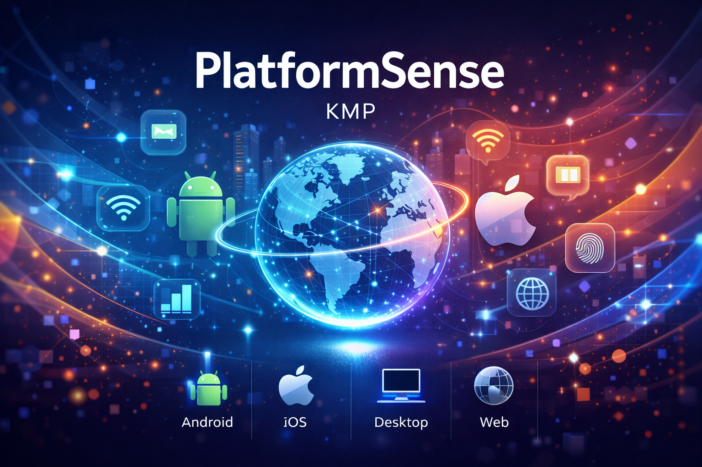

<p align="center">
  
</p>

<p align="center">
  
  
  
  
</p>

# PlatformSense KMP

**Platform awareness and device capability intelligence for Kotlin Multiplatform.**

---

## 1. Hero + Tagline

PlatformSense is a Kotlin Multiplatform library that makes **platform and device awareness a first-class primitive** in KMP applications. One API for environment and capability signals across Android, iOS, Desktop, and Web—no more scattered expect/actual boilerplate.

---

## 2. Why PlatformSense Exists

### The Problem

Today, every KMP app reimplements the same wrappers for:

- Network detection (WiFi, cellular, metered)
- Battery and power state
- Biometric availability
- Locale and timezone
- Device class (phone, tablet, desktop)

This leads to **repeated work**, **inconsistent naming**, **poor testing support**, and **hard onboarding**. There is no unified way to answer: “What is the device’s power state? Network type? Does it support biometrics?” without gluing together platform APIs yourself.

### The Vision

PlatformSense aims to become the **standard environment + capability SDK** for Kotlin Multiplatform—similar to how Ktor covers networking, Koin covers dependency injection, and Coil covers image loading. **PlatformSense = environment + capability intelligence.**

### Non-Goals

PlatformSense will **not**:

- Control hardware (camera, Bluetooth, sensors)
- Replace platform SDKs
- Act as an analytics or security SDK (only basic capability signals)

---

## 3. What PlatformSense Provides

A **unified, type-safe, reactive API** for:

| Area | Description |
|------|-------------|
| **Device capabilities** | Biometric availability, secure hardware, accessibility signals |
| **Runtime environment** | Network type, power state, device class |
| **Platform context** | Locale, timezone |
| **OS feature availability** | Capability checks without touching platform APIs directly |

All exposed via **domain models** (e.g. `EnvironmentSnapshot`, `CapabilitiesSnapshot`), with both **snapshot** and **Flow**-based reactive access.

---

## 4. Quick Start

### Repository

Add to `settings.gradle.kts`:

```kotlin
dependencyResolutionManagement {
    repositories {
        google()
        mavenCentral()
        maven { url = uri("https://jitpack.io") }
    }
}
```

### Dependencies

In your module’s `build.gradle.kts`:

```kotlin
dependencies {
    implementation("com.github.anandkumarkparmar.platformsense-kmp:platformsense-core:0.1.0")
    implementation("com.github.anandkumarkparmar.platformsense-kmp:platformsense-android:0.1.0")
    testImplementation("com.github.anandkumarkparmar.platformsense-kmp:platformsense-testing:0.1.0")
}
```

### Android Setup

**Initialization** in `Application` (or main `Activity`):

```kotlin
import io.platformsense.core.PlatformSense
import io.platformsense.platform.android.AndroidPlatformSenseWiring

class MyApplication : Application() {
    override fun onCreate() {
        super.onCreate()
        PlatformSense.initialize(AndroidPlatformSenseWiring(this))
    }
}
```

### Basic Usage

```kotlin
// Snapshot
val env = PlatformSense.environment()
val caps = PlatformSense.capabilities()

// Reactive
PlatformSense.environmentFlow.collect { env -> updateUI(env) }
```

---

## 5. Supported Features

| Feature | Description |
|---------|-------------|
| **Network type** | WiFi, cellular, metered, none |
| **Power state** | Normal, low power, charging |
| **Device class** | Phone, tablet, desktop, TV |
| **Locale** | Current locale |
| **Timezone** | Current timezone |
| **Biometric capability** | Availability of biometric auth |
| **Reactive updates** | Kotlin `Flow` for environment changes |

*Planned (not in current MVP): thermal state, performance hints, deeper accessibility signals, security attestation.*

---

## 6. Platform Support Matrix

| Platform | Status | Min Version / Notes |
|----------|--------|----------------------|
| **Android** | Supported | API 23+ (Android 6.0) |
| **iOS** | Planned | — |
| **Desktop** | Planned | — |
| **Web** | Planned | — |

---

## 7. Example Use Cases

**Feature optimization (e.g. reduce animations in low power):**

```kotlin
if (PlatformSense.environment().powerState == PowerState.LOW_POWER) {
    disableAnimations()
}
```

**Network-adaptive content (e.g. lower image quality on metered):**

```kotlin
if (PlatformSense.environment().networkType.isMetered) {
    loadLowResImages()
}
```

**Capability-based feature (e.g. show biometric login only when available):**

```kotlin
if (PlatformSense.capabilities().biometric.isAvailable) {
    showBiometricLogin()
}
```

**Reactive UI from environment changes:**

```kotlin
PlatformSense.environmentFlow.collect { env ->
    updateUI(env)
}
```

**Testing (override environment in tests):**

```kotlin
PlatformSense.overrideEnvironment(powerState = PowerState.LOW_POWER)
```

---

## 8. Architecture Overview

### High-Level Architecture

```
┌─────────────────────────────────────────────────────────────────────────────┐
│                              Your App / Client                              │
└─────────────────────────────────────────────────────────────────────────────┘
                                        │
                                        ▼
┌─────────────────────────────────────────────────────────────────────────────┐
│                         PlatformSense (Public Facade)                       │
│  • environment()  • capabilities()  • environmentFlow  • override*(...)     │
└─────────────────────────────────────────────────────────────────────────────┘
                    │                                            │
                    ▼                                            ▼
┌───────────────────────────────────┐           ┌───────────────────────────────────┐
│     EnvironmentRepository         │           │     CapabilitiesRepository        │
│      • EnvironmentSnapshot        │           │       • CapabilitiesSnapshot      │
└───────────────────────────────────┘           └───────────────────────────────────┘
                    │                                                   │
        ┌───────────┼───────────┬───────────┬───────────┐               │
        ▼           ▼           ▼           ▼           ▼               ▼
┌───────────┐ ┌───────────┐ ┌─────────┐ ┌───────────┐ ┌───────────┐ ┌─────────────┐
│  Network  │ │   Power   │ │ Device  │ │   Locale  │ │  Timezone │ │  Biometric  │
│  Provider │ │  Provider │ │ Provider│ │  Provider │ │  Provider │ │  Provider   │
└───────────┘ └───────────┘ └─────────┘ └───────────┘ └───────────┘ └─────────────┘
        │           │           │             │             │             │
        └───────────┴───────────┴─────────────────────────────────────────┘
                                │
                                ▼
┌─────────────────────────────────────────────────────────────────────────────┐
│              Platform Implementations (Android / iOS / Desktop / Web)       │
└─────────────────────────────────────────────────────────────────────────────┘
```

### Module Structure

```
platformsense-core           # Domain + facade + repositories
platformsense-android        # Android providers
platformsense-testing        # Fakes and test rules
```

*(Future: `platformsense-ios`, `platformsense-desktop`, `platformsense-web`.)*

### Internal Layers

1. **Providers (platform-specific)** — e.g. `NetworkProvider`, `PowerProvider`, `DeviceProvider`, `LocaleProvider`, `BiometricProvider`.
2. **Aggregators** — Combine providers into `EnvironmentSnapshot` and `CapabilitiesSnapshot`.
3. **Public facade** — `PlatformSense.environment()`, `PlatformSense.capabilities()`, `PlatformSense.environmentFlow`.

### Design Patterns

- **Facade** — `PlatformSense` as single entry point.
- **Provider** — One provider per signal.
- **Repository** — Environment repository aggregates providers.
- **Strategy** — Platform-specific implementations behind shared interfaces; DI-friendly for testing.

---

## 9. Design Principles

| Principle | Description |
|-----------|-------------|
| **Domain-first** | Public API uses domain models only, never raw platform types. |
| **Reactive + snapshot** | Both one-shot queries and `Flow`-based streams. |
| **Platform-safe** | Unsupported signals return `UNKNOWN`, no crashes. |
| **Lightweight** | Feels like a standard-library extension. |
| **Test-first** | Override and fake providers are first-class (see Testing Support). |

---

## 10. Testing Support

The `platformsense-testing` module provides **fake providers** and a **test rule** so you can drive environment and capabilities in unit tests.

**Example: simulate low power in tests**

```kotlin
import io.platformsense.testing.PlatformSenseTestRule
import io.platformsense.testing.fake.FakePlatformSenseWiring

class MyTest {
    private val testRule = PlatformSenseTestRule()

    @Before
    fun setup() {
        testRule.install()
    }

    @After
    fun teardown() {
        testRule.uninstall()
    }

    @Test
    fun testLowPowerMode() {
        testRule.wiring.powerProvider.currentValue = PowerState.LOW_POWER
        val env = PlatformSense.environment()
        assertEquals(PowerState.LOW_POWER, env.powerState)
    }
}
```

You can override any provider (network, power, device, locale, timezone, biometric) to test feature gating, adaptive behavior, and offline/low-power flows without real device state.

---

## 11. Roadmap

### Environment Providers

| Phase | Providers |
|-------|-----------|
| **MVP** | `NetworkProvider`, `PowerProvider`, `DeviceProvider`, `LocaleProvider`, `TimezoneProvider` |
| **Future** | `ThermalProvider`, `AccessibilityStateProvider`, `NetworkQualityProvider`, `PerformanceHintProvider`, `BatteryHealthProvider`, `DisplayEnvironmentProvider` |

### Capability Providers

| Phase | Providers |
|-------|-----------|
| **MVP** | `BiometricProvider` |
| **Future** | `SecureHardwareProvider`, `CameraCapabilityProvider`, `ConnectivityCapabilityProvider`, `SecurityAttestationCapabilityProvider`, `InputCapabilityProvider` |

### Platforms

- **Current:** Android (API 23+)
- **Planned:** iOS, Desktop, Web

---

## 12. Contributing

Contributions are welcome. Here’s how to get started:

### Reporting issues

- **Bugs:** Open an issue with steps to reproduce, expected vs actual behavior, and your environment (OS, Kotlin/Gradle versions).
- **Features:** Open an issue describing the use case and proposed API or behavior so we can align before you code.

### Submitting changes

1. **Fork** the repository and create a branch from `main` (e.g. `feature/your-feature` or `fix/issue-description`).
2. **Implement** your change. Keep the scope small; split large changes into multiple PRs.
3. **Follow project style:** Use the existing code style, respect `.editorconfig` and Detekt configuration.
4. **Add or update tests** for new or changed behavior. Use the `platformsense-testing` module for provider/aggregator logic.
5. **Run checks:** Ensure `./gradlew build` and `./gradlew detekt` pass.
6. **Open a Pull Request** against `main` with a clear title and description. Reference any related issues.

### Code and design

- Prefer immutable domain models and `Flow` for reactive signals.
- Keep platform logic in platform modules; domain stays platform-agnostic.
- New providers should follow the existing provider pattern and be testable via fakes.

---

## 13. License

```
   Copyright 2026 Anand K Parmar

   Licensed under the Apache License, Version 2.0 (the "License");
   you may not use this file except in compliance with the License.
   You may obtain a copy of the License at

       http://www.apache.org/licenses/LICENSE-2.0

   Unless required by applicable law or agreed to in writing, software
   distributed under the License is distributed on an "AS IS" BASIS,
   WITHOUT WARRANTIES OR CONDITIONS OF ANY KIND, either express or implied.
   See the License for the specific language governing permissions and
   limitations under the License.
```
