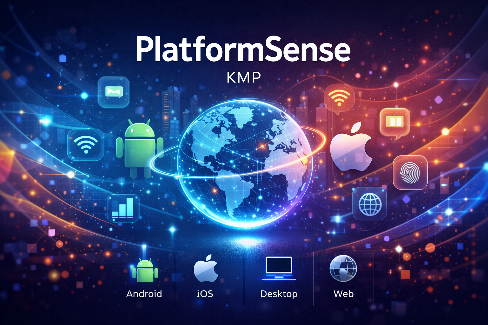

<p align="center">
  
</p>

<p align="center">
  
  
  
  
</p>

# PlatformSense KMP

**Platform awareness and device capability intelligence for Kotlin Multiplatform.**

PlatformSense is a Kotlin Multiplatform library that makes **platform and device awareness a first-class primitive** in KMP applications. One API for environment and capability signals across Android, iOS, Desktop, and Web — no more scattered expect/actual boilerplate.

---

## Quick Start

Add JitPack to `settings.gradle.kts`:

```kotlin
dependencyResolutionManagement {
    repositories {
        google()
        mavenCentral()
        maven { url = uri("https://jitpack.io") }
    }
}
```

Add dependencies in your module's `build.gradle.kts`:

```kotlin
dependencies {
    // 1. Core domain & interfaces (required)
    implementation("io.github.anandkumarkparmar:platformsense-core:0.1.0")
    
    // 2. Platform implementations (opt-in as needed)
    implementation("io.github.anandkumarkparmar:platformsense-android:0.1.0")
    implementation("io.github.anandkumarkparmar:platformsense-ios:0.1.0")
    
    // 3. Testing tools
    testImplementation("io.github.anandkumarkparmar:platformsense-testing:0.1.0")
}
```

Initialize in your `Application` class (Android):

```kotlin
PlatformSense.initialize(AndroidPlatformSenseWiring(this))
```

Initialize in your `AppDelegate` (iOS/Swift):

```swift
import PlatformSenseIos

PlatformSenseWiringKt.initializePlatformSense()
```

Start querying:

```kotlin
// Snapshot
val env = PlatformSense.environment()
val caps = PlatformSense.capabilities()

// Reactive
PlatformSense.environmentFlow.collect { env -> updateUI(env) }
```

<!-- SCREENSHOT: Sample app running on Android/iOS showing environment signals -->

📖 **[Full setup guide →](docs/getting-started.md)**

---

## Features

| Feature | Description |
|---------|-------------|
| **Network state** | WiFi, cellular, metered, roaming detection |
| **Power info** | Battery level, low power mode, charging, thermal state |
| **Device info** | Phone, tablet, desktop, TV + manufacturer, model, OS |
| **Locale** | Language tag, country, 24-hour format preference |
| **Timezone** | IANA ID, display name, UTC offset |
| **Biometric** | Fingerprint, Face ID, iris — status + type |
| **Reactive updates** | Kotlin `Flow` for real-time environment changes |
| **Test-first** | Fake providers & test rule for unit tests |

---

## Platform Support

| Platform | Status | Notes |
|----------|--------|-------|
| **Android** | ✅ Supported | API 23+ |
| **iOS** | ✅ Supported | iOS 14+ |
| **Desktop** | 🔜 Planned | — |
| **Web** | 🔜 Planned | — |

📖 **[Full platform details →](docs/platform-support.md)**

---

## Documentation

| Guide | Description |
|-------|-------------|
| **[Getting Started](docs/getting-started.md)** | Installation, setup per platform, first usage |
| **[API Reference](docs/api-reference.md)** | Every model, enum, method, and property |
| **[Architecture](docs/architecture.md)** | Modules, layers, patterns, data flow diagrams |
| **[Platform Support](docs/platform-support.md)** | Feature matrix, native APIs, known limitations |
| **[Testing Guide](docs/testing-guide.md)** | Fake providers, test rule, testing patterns |
| **[Use Cases & Recipes](docs/use-cases-and-recipes.md)** | 9+ real-world code recipes |
| **[Design Principles](docs/design-principles.md)** | Domain-first, reactive, platform-safe philosophy |
| **[Roadmap](docs/roadmap.md)** | Current status and future plans |
| **[Contributing](docs/contributing.md)** | How to report issues, submit PRs, add providers |

---

## Example

```kotlin
// Adapt to power state
if (PlatformSense.environment().powerInfo.status == PowerState.LOW_POWER) {
    disableAnimations()
}

// Adapt to network
if (PlatformSense.environment().networkInfo.isMetered) {
    loadLowResImages()
}

// Gate on biometrics
if (PlatformSense.capabilities().biometric.status == BiometricStatus.READY) {
    showBiometricLogin()
}
```

📖 **[More recipes →](docs/use-cases-and-recipes.md)**

---

## Contributing

Contributions are welcome! See the **[Contributing Guide](docs/contributing.md)** for how to get started, report issues, and submit pull requests.

---

## License

```
   Copyright 2026 Anand K Parmar

   Licensed under the Apache License, Version 2.0 (the "License");
   you may not use this file except in compliance with the License.
   You may obtain a copy of the License at

       http://www.apache.org/licenses/LICENSE-2.0

   Unless required by applicable law or agreed to in writing, software
   distributed under the License is distributed on an "AS IS" BASIS,
   WITHOUT WARRANTIES OR CONDITIONS OF ANY KIND, either express or implied.
   See the License for the specific language governing permissions and
   limitations under the License.
```
