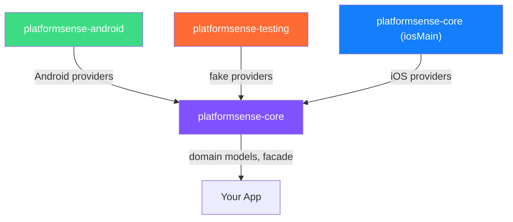
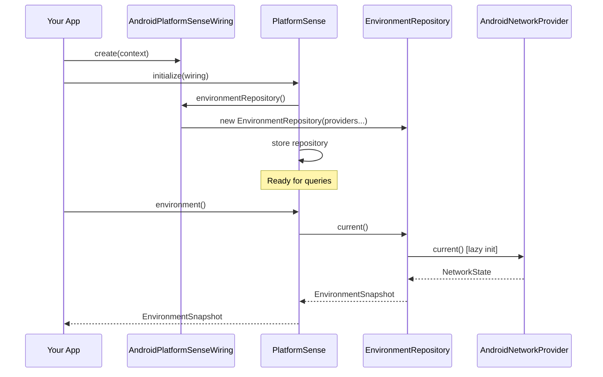
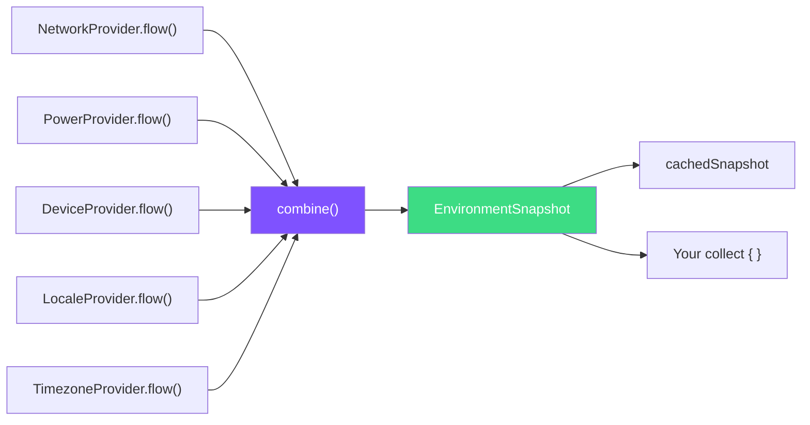
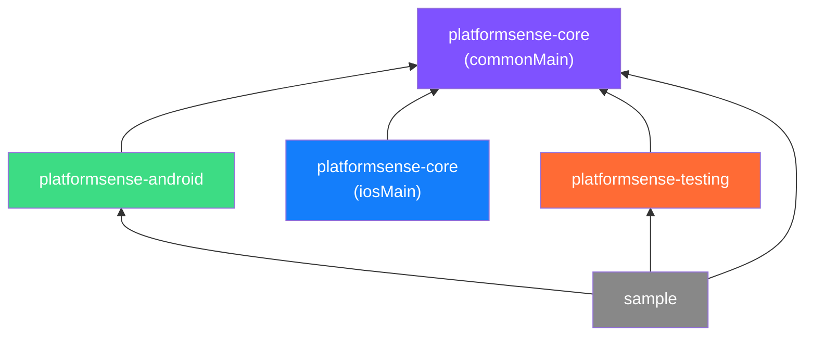

# Architecture

Deep dive into the internal architecture of PlatformSense KMP — modules, layers, design patterns, and data flow.

---

## High-Level Architecture

```
┌─────────────────────────────────────────────────────────────────────────────┐
│                              Your App / Client                              │
└─────────────────────────────────────────────────────────────────────────────┘
                                        │
                                        ▼
┌─────────────────────────────────────────────────────────────────────────────┐
│                         PlatformSense (Public Facade)                       │
│  • environment()  • capabilities()  • environmentFlow  • initialize()       │
└─────────────────────────────────────────────────────────────────────────────┘
                    │                                            │
                    ▼                                            ▼
┌───────────────────────────────────┐           ┌───────────────────────────────────┐
│     EnvironmentRepository         │           │     CapabilitiesRepository        │
│      • EnvironmentSnapshot        │           │       • CapabilitiesSnapshot      │
└───────────────────────────────────┘           └───────────────────────────────────┘
                    │                                                   │
        ┌───────────┼───────────┬───────────┬───────────┐               │
        ▼           ▼           ▼           ▼           ▼               ▼
┌───────────┐ ┌───────────┐ ┌─────────┐ ┌───────────┐ ┌───────────┐ ┌─────────────┐
│  Network  │ │   Power   │ │ Device  │ │   Locale  │ │  Timezone │ │  Biometric  │
│  Provider │ │  Provider │ │ Provider│ │  Provider │ │  Provider │ │  Provider   │
└───────────┘ └───────────┘ └─────────┘ └───────────┘ └───────────┘ └─────────────┘
        │           │           │             │             │             │
        └───────────┴───────────┴─────────────────────────────────────────┘
                                │
                                ▼
┌─────────────────────────────────────────────────────────────────────────────┐
│              Platform Implementations (Android / iOS / Desktop / Web)       │
└─────────────────────────────────────────────────────────────────────────────┘
```

<!-- SCREENSHOT: High-resolution render of architecture diagram -->

---

## Module Structure

PlatformSense is organized into three Gradle modules, each with a clear responsibility boundary:



### `platformsense-core`

The heart of the library. Contains **no platform-specific code** in `commonMain`.

| Contents | Description |
|----------|-------------|
| Domain models | `EnvironmentSnapshot`, `CapabilitiesSnapshot`, `NetworkState`, `PowerInfo`, `DeviceInfo`, `LocaleInfo`, `TimezoneInfo`, `BiometricCapability` |
| Provider interfaces | `NetworkProvider`, `PowerProvider`, `DeviceProvider`, `LocaleProvider`, `TimezoneProvider`, `BiometricProvider` |
| Repositories | `EnvironmentRepository`, `CapabilitiesRepository` — aggregate providers |
| Public facade | `PlatformSense` object — single entry point |
| Wiring interface | `PlatformSenseWiring` — bridge between core and platform |
| iOS providers | In `iosMain` source set — `IosPlatformSenseWiring` + all iOS provider implementations |

### `platformsense-android`

Android-specific provider implementations.

| Contents | Description |
|----------|-------------|
| `AndroidPlatformSenseWiring` | Creates repositories with Android providers |
| `AndroidNetworkProvider` | Uses `ConnectivityManager` and `NetworkCallback` |
| `AndroidPowerProvider` | Uses `PowerManager` and `BatteryManager` |
| `AndroidDeviceProvider` | Uses `Build`, `Configuration`, screen metrics |
| `AndroidLocaleProvider` | Uses `Locale` and `DateFormat` |
| `AndroidTimezoneProvider` | Uses `TimeZone` |
| `AndroidBiometricProvider` | Uses `BiometricManager` |

### `platformsense-testing`

Test utilities for overriding PlatformSense behavior in unit tests.

| Contents | Description |
|----------|-------------|
| `PlatformSenseTestRule` | Install/uninstall lifecycle for tests |
| `FakePlatformSenseWiring` | Wires all fake providers together |
| `Fake*Provider` | One fake per provider (Network, Power, Device, Locale, Timezone, Biometric) |

---

## Internal Layers

PlatformSense follows a strict three-layer architecture. Data flows upward from platform-specific providers to the unified facade.

### Layer 1 — Providers (Platform-Specific)

Each signal (network, power, device, locale, timezone, biometric) has a **provider interface** in `platformsense-core`:

```kotlin
// Example: NetworkProvider interface
interface NetworkProvider {
    fun current(): NetworkState
    fun flow(): Flow<NetworkState>
}
```

Each platform implements these interfaces with native APIs:

| Provider | Android API | iOS API |
|----------|-------------|---------|
| `NetworkProvider` | `ConnectivityManager`, `NetworkCallback` | `NWPathMonitor` |
| `PowerProvider` | `PowerManager`, `BatteryManager` | `UIDevice.batteryLevel`, `ProcessInfo` |
| `DeviceProvider` | `Build`, `Configuration` | `UIDevice`, `UIScreen` |
| `LocaleProvider` | `Locale`, `DateFormat` | `NSLocale` |
| `TimezoneProvider` | `TimeZone` | `NSTimeZone` |
| `BiometricProvider` | `BiometricManager` | `LAContext` |

### Layer 2 — Repositories (Aggregators)

Repositories combine multiple providers into a single snapshot:

```kotlin
class EnvironmentRepository(
    private val networkProvider:  () -> NetworkProvider,
    private val powerProvider:    () -> PowerProvider,
    private val deviceProvider:   () -> DeviceProvider,
    private val localeProvider:   () -> LocaleProvider,
    private val timezoneProvider: () -> TimezoneProvider,
)
```

Key design decisions:
- **Lambda factories** (`() -> Provider`) enable **lazy initialization** — providers are created only on first use
- **`current()`** queries all providers and returns an `EnvironmentSnapshot`
- **`flow()`** uses Kotlin's `combine` to merge all provider flows into a single `Flow<EnvironmentSnapshot>`
- **Caching** — the repository caches the last snapshot and updates it on each flow emission

### Layer 3 — Public Facade

`PlatformSense` is the **single entry point** that delegates to repositories:

```kotlin
object PlatformSense {
    fun environment(): EnvironmentSnapshot = requireEnvironmentRepository().current()
    val environmentFlow: Flow<EnvironmentSnapshot> get() = requireEnvironmentRepository().flow()
    fun capabilities(): CapabilitiesSnapshot = requireCapabilitiesRepository().current()
}
```

---

## Wiring Mechanism

The **wiring pattern** is how PlatformSense bridges the gap between platform-agnostic core and platform-specific providers — without the core module ever importing platform types.



### Why Wiring?

1. **Core stays clean** — `platformsense-core` has zero platform imports in `commonMain`
2. **Extensible** — adding a new platform means implementing `PlatformSenseWiring` once
3. **Testable** — `FakePlatformSenseWiring` allows complete control in tests
4. **No service locator / DI framework required** — simple constructor injection

---

## Reactive Pipeline

The reactive pipeline uses Kotlin Coroutines `Flow` and the `combine` operator:



When any single provider emits a new value, `combine` re-emits an updated `EnvironmentSnapshot` with the latest values from all providers. This means:

- **Granular updates** — only changed signals trigger re-emission
- **Always consistent** — the snapshot always reflects the latest state of every signal
- **Lazy collection** — no work happens until something collects the flow

---

## Design Patterns

### Facade Pattern

`PlatformSense` acts as the **single, simplified entry point** to the entire library. Clients never interact with repositories or providers directly.

**Why?** Reduces the learning curve. One import, one object, three methods.

### Provider Pattern

Each environmental signal is encapsulated in its own provider interface. This achieves **single responsibility** — each provider does one thing well.

**Why?** Makes it easy to add new signals without touching existing code.

### Repository Pattern

`EnvironmentRepository` and `CapabilitiesRepository` **aggregate** multiple providers into unified snapshots. They own the caching logic and flow combining.

**Why?** Clients get a single consistent snapshot instead of querying providers individually.

### Strategy Pattern

Platform-specific implementations are swapped behind shared interfaces. At initialization time, the wiring selects the correct strategy (Android providers, iOS providers, or fakes).

**Why?** Perfect for testing — swap real providers with fakes without changing client code.

---

## Dependency Graph



**Key constraints:**
- `platformsense-core` (commonMain) depends on nothing except Kotlin stdlib and Coroutines
- `platformsense-android` depends on `platformsense-core` + Android SDK
- `platformsense-core` (iosMain) depends on iOS frameworks (Foundation, UIKit, LocalAuthentication, Network)
- `platformsense-testing` depends only on `platformsense-core`
- The sample app depends on all modules

---

## See Also

- **[API Reference](api-reference.md)** — Detailed reference for every class and interface
- **[Design Principles](design-principles.md)** — The philosophy behind architectural decisions
- **[Platform Support](platform-support.md)** — How each platform implements providers
